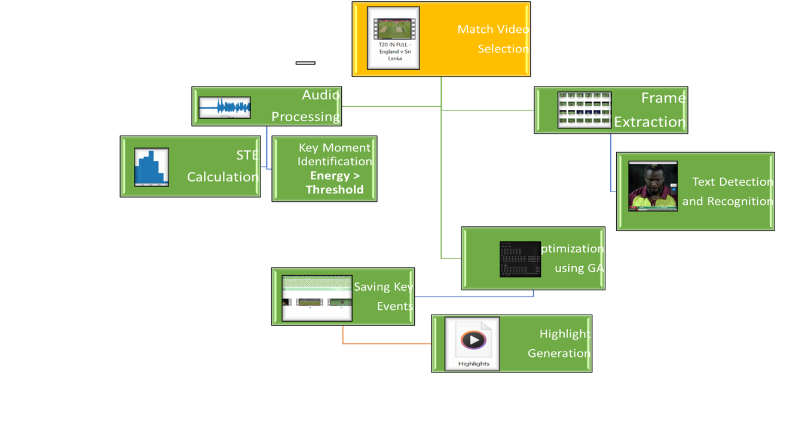
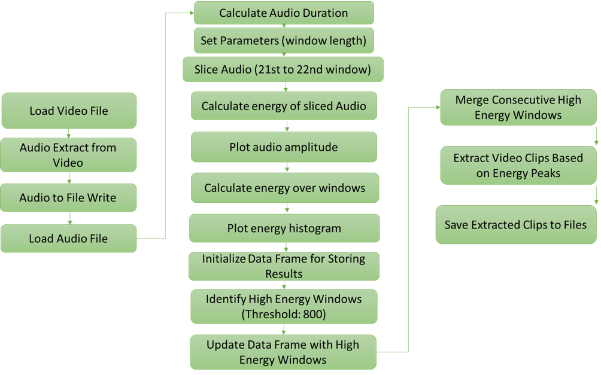
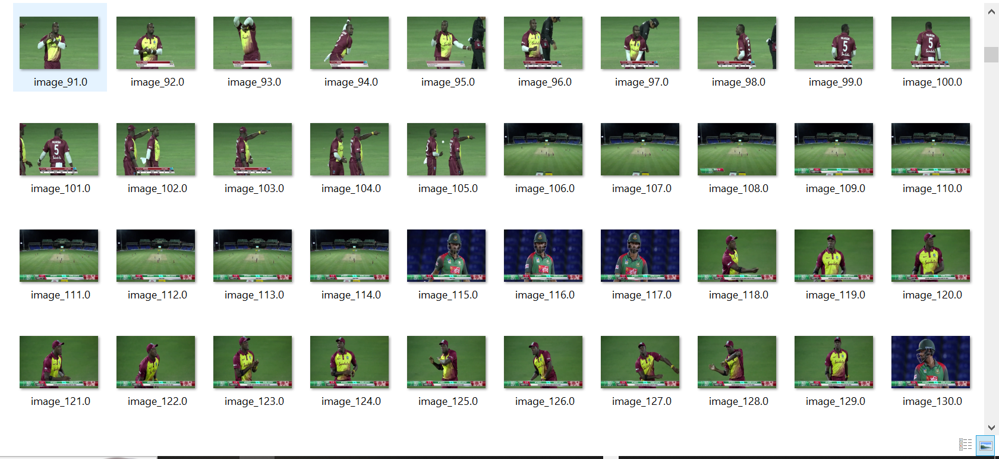
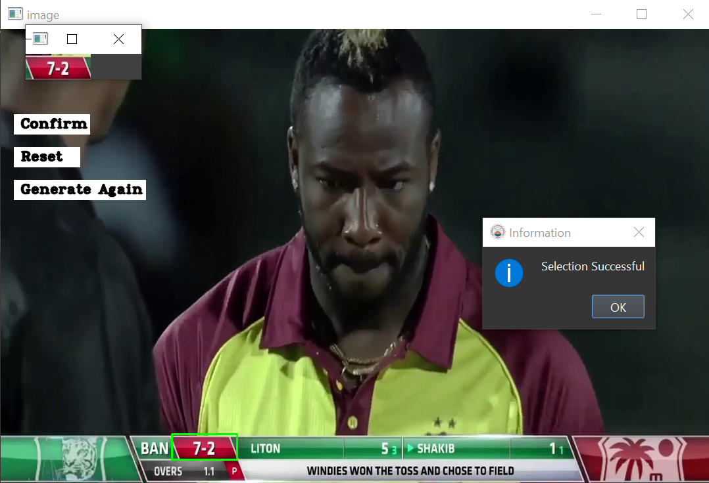
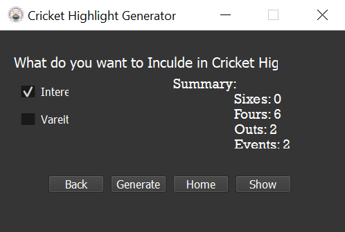

Here’s an updated README file template based on your project details:

---

# Cricket Highlight Generator

## Project Description

This project is focused on generating highlights from cricket match videos by analyzing audio excitement levels, extracting score-based events, and applying genetic algorithms for optimization. The primary objective is to automatically create engaging highlights from long cricket match videos by identifying key moments based on audio energy peaks and video frame analysis.

### Features:

1. **Audio Processing**: 
   - Extracts audio from the cricket match video.
   - Calculates the Short-Time Energy (STE) to identify moments of high excitement.
   - Merges consecutive high-energy windows and saves the associated video clips.

2. **Frame Extraction**:
   - Extracts frames from the video for further processing.
   - Performs text detection and recognition on frames to extract scores and important events.
   - Applies Genetic Algorithms (GA) for optimizing the selection of highlight clips.

3. **Highlight Generation**:
   - Combines the selected key moments into a single highlight video.
   - Provides a user-friendly interface to generate and preview highlights.

### Project Flow:

1. **Match Video Selection**:
   - Select the cricket match video to be processed.

2. **Audio Processing**:
   - Calculate Short-Time Energy (STE) to identify key moments of excitement.

3. **Frame Extraction**:
   - Extract video frames for further analysis.

4. **Text Detection and Recognition**:
   - Detect and recognize text in frames to identify scores and other key information.

5. **Optimization using Genetic Algorithms**:
   - Apply GA to optimize the selection of clips for the final highlight video.

6. **Highlight Generation**:
   - Generate the final highlight video based on the optimized selection.

### Flow Diagrams:

## Installation

To get started with the project, follow these steps:

### Prerequisites

1. **Python 3.x**: Ensure that Python is installed on your system.
2. **ffmpeg**: Required for processing video and audio.
3. **Tesseract OCR**: Required for text detection and recognition in frames.

### Step 1: Clone the Repository

git clone https://github.com/MaroofAshraf/Cricket-Highlight-Generator-Audio-Score-GA.git
cd Cricket-Highlight-Generator

### Step 2: Install Required Libraries

Install the necessary Python libraries using `pip`:

pip install -r requirements.txt

### Step 3: Install ffmpeg

Download and install `ffmpeg`:

- [Windows](https://ffmpeg.org/download.html)
- [Linux](https://ffmpeg.org/download.html)
- [MacOS](https://ffmpeg.org/download.html)

Make sure `ffmpeg` is added to your system’s PATH.

### Step 4: Install Tesseract OCR

Download and install Tesseract:

- [Windows](https://github.com/UB-Mannheim/tesseract/wiki)
- [Linux](https://github.com/tesseract-ocr/tesseract)
- [MacOS](https://github.com/tesseract-ocr/tesseract)

After installation, ensure that the Tesseract executable is added to your system’s PATH.

## Usage

1. **Run the Main Application**:
   - Use the GUI to load a cricket match video and start generating highlights.

2. **Select Parameters**:
   - Set the frame extraction rate, audio energy threshold, and other parameters.

3. **Generate Highlights**:
   - The application will process the video and generate highlights based on the specified criteria.

## Contributing

Feel free to submit issues, fork the repository, and send pull requests. We welcome contributions to improve the project!

## License

This project is licensed under the MIT License - see the LICENSE file for details.

## Acknowledgments

- [ffmpeg](https://ffmpeg.org/)
- [Tesseract OCR](https://github.com/tesseract-ocr/tesseract)
- [Python](https://www.python.org/)
